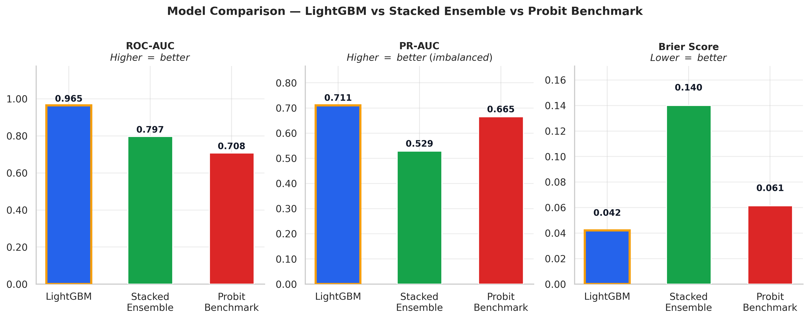
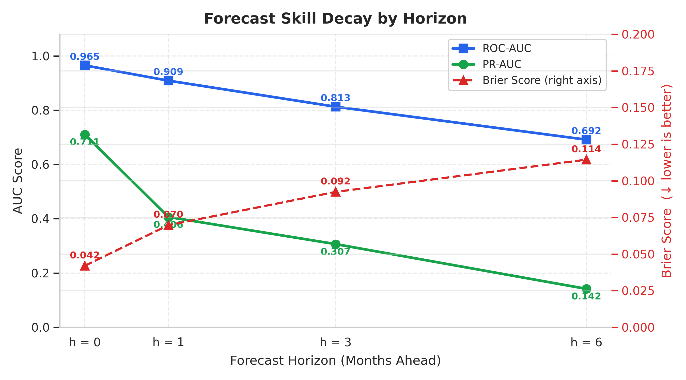
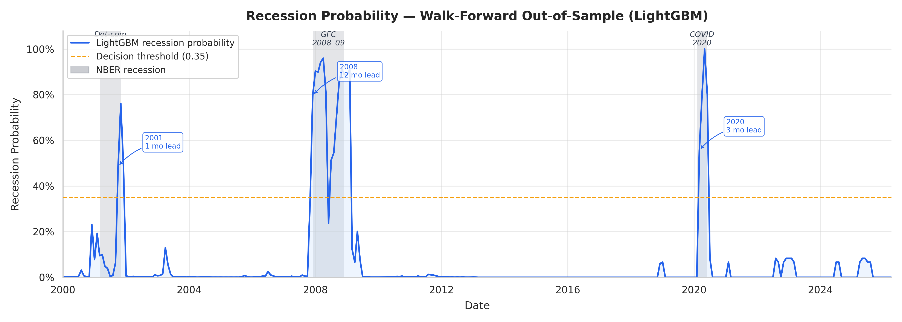
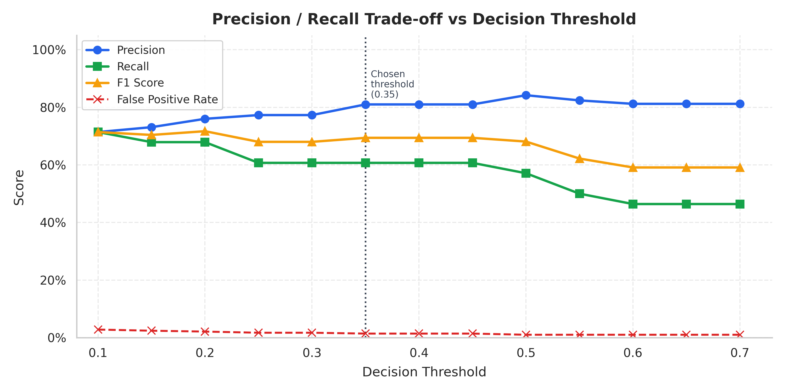
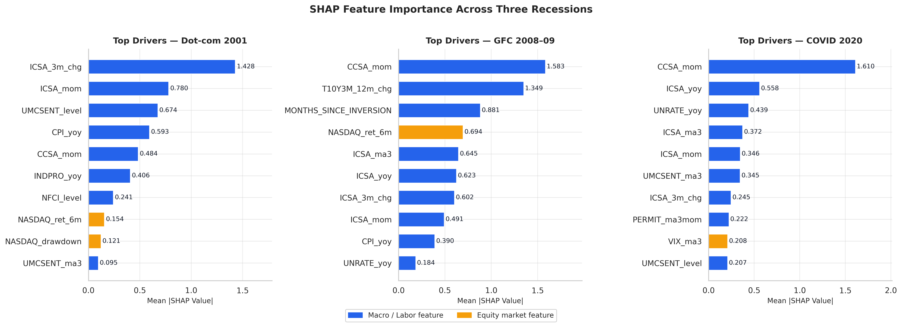

# Recession Nowcasting

**A LightGBM-based nowcast of US recession probability**, walk-forward validated from 2000 to present, benchmarked against the classic yield-curve/financial-conditions probit model, with an explicit simulation of the information lag NBER itself operates under.

I built this to answer: can a model built on real-time macro/market data flag a recession *before* it's officially declared  and does it actually beat the simple academic benchmark, or just look good in-sample?

**Short answer: yes, with caveats.** The main LightGBM model separates recession months from expansion months very well (ROC-AUC **0.965** at nowcast horizon) and would have flagged all three in-sample recessions (2001, 2008-09, 2020) an average of **~5 months before NBER's official announcement.** But horizon decay is steep past the current month, and  the honest surprise **stacking the LightGBM and probit models into an ensemble made things worse, not better.**

<div align="center">

| ROC-AUC (nowcast) | Avg. lead vs. NBER announcement | False alarm rate | 
|---|---|---|
| **0.965** | **~5 months early** | **1.4%** | 

</div>

---

## Why this project

Recessions are only officially dated by the NBER 6-21 months *after* they've already started, since the committee waits for revised data and a clear picture. That's a real cost: policy, hiring, and portfolio decisions can't wait a year and a half for confirmation. A nowcasting model's whole value proposition is closing that gap using data that was actually available in real time not data that's since been revised to look cleaner than it did in the moment.

That last part is why this project pulls **point-in-time (ALFRED) vintages** for every series that gets revised after the fact (industrial production, retail sales, building permits, housing starts, durable goods orders) instead of today's revised values. A model trained on revised data is quietly cheating it's using information nobody actually had at the time.

## What I tested

1. Can a model built on real-time data separate recession months from expansion months? **Yes, strongly.** ROC-AUC 0.965 at horizon 0.2. Does it fire meaningfully before NBER's official call? **Yes** flagged all 3 in-sample recessions ahead of the announcement, averaging ~5 months lead.
3. Does accuracy hold up further out (1, 3, 6 months ahead)? **No decays fast.** 
4. Does combining the ML model with the classic probit benchmark improve things? **No it got worse.** 
5. Is the model well-calibrated, or just good at ranking? Checked directly with reliability curves and Brier decomposition. See Results.

## Dataset

Monthly data, 1980–2026 (**556 months**, 58 of them NBER recession months a ~10.4% base rate).

| Category | Series |
|---|---|
| Yield curve | 10Y-2Y spread, 10Y-3M spread, 10Y yield, 2Y yield |
| Credit spreads | High-yield (junk) spread, BBB corporate spread |
| Financial conditions | Chicago Fed NFCI, St. Louis Fed STLFSI |
| Surveys | ISM Manufacturing PMI, UMich Consumer Sentiment, Economic Policy Uncertainty |
| Labor market | Initial & continued jobless claims, unemployment rate, real-time Sahm Rule |
| Money & prices | M2 money supply, CPI, credit card delinquency rate |
| Activity (vintage-pulled) | Industrial production, retail sales, building permits, housing starts, durable goods orders |
| Alternative data | Google Trends ("job loss," "unemployment benefits," "foreclosure," etc.), Weekly Economic Index |
| Equities | S&P 500, NASDAQ, VIX |
| Target | NBER recession dummy (USRECD) |

~118 engineered features total after transforms (levels, changes, rolling stats) — full list in `model/feature_cols.joblib`.

## Methodology

```
FRED / ALFRED pull
      │
Vintage reconstruction ── revised series pulled as-of each historical month
      │                    (no look-ahead from data revisions)
Feature engineering ── ~118 features: levels, changes, rolling stats
      │
Walk-forward evaluation, expanding window, from 2000-01
 ├── 24-month NBER blackout on every training window
 │    (simulates the real announcement lag model never
 │     trains on a label it couldn't have known yet)
 ├── LightGBM (main model)
 ├── Probit / logistic benchmark (T10Y3M + NFCI only the
 │    classic academic yield-curve recession model)
 └── Stacked ensemble (meta-model over both)
      │
Isotonic calibration
      │     
Evaluation: ROC-AUC, PR-AUC, Brier decomposition, block
bootstrap, threshold sweep, reliability curves, SHAP,
lead-time vs. NBER announcements, multi-horizon decay
```

## Models

| Model | Role |
|---|---|
| LightGBM | Main model full ~118-feature set |
| Probit (logistic) | Classic benchmark only the 10Y-3M spread + NFCI, the standard academic yield-curve setup |
| Stacked ensemble | Meta-model combining LightGBM + probit probabilities |

Each walk-forward step retrains from scratch on an **expanding window that stops 24 months before the prediction date** — the same lag NBER itself operates under so no model ever sees a label before it could plausibly have been dated.

## Evaluation framework

- **ROC-AUC / PR-AUC** : ranking quality, with PR-AUC weighted toward the (rare) recession class
- **Brier score decomposition** : overall, recession-months-only, expansion-months-only, since a good *overall* score can hide a model that's bad specifically during the periods that matter
- **Block bootstrap** (500 resamples, 12-month blocks) :  preserves the fact that recessions cluster in time, unlike a naive i.i.d. bootstrap
- **Threshold sweep** : precision/recall/F1/false-positive-rate across candidate decision thresholds
- **Reliability curves** : is a predicted 70% actually right ~70% of the time?
- **Lead-time analysis** : how many months before NBER's official announcement did the model first cross the signal threshold?
- **SHAP** : which features actually drive the prediction, and does that change during specific recessions?
- **Multi-horizon test** (0, 1, 3, 6 months ahead) : does accuracy hold as you push further from "now"?

---

## Results

**Nowcast (horizon 0) performance.** LightGBM separates recession from expansion months very well ROC-AUC **0.965**, PR-AUC **0.711**  and does so with a low false alarm rate (**1.4%** of expansion months incorrectly flagged above the 0.35 signal threshold). The probit benchmark, using just two features, does respectably (ROC-AUC 0.708) but is clearly outperformed by the full feature set.

| Model | ROC-AUC | PR-AUC | Brier (overall) | Brier (recession) | Brier (expansion) | False alarm rate |
|---|---|---|---|---|---|---|
| **LightGBM** | **0.965** | **0.711** | **0.042** | 0.372 | **0.010** | **1.4%** |
| Probit benchmark | 0.708 | 0.665 | 0.061 | 0.653 | 0.004 | 0.0% |
| Stacked ensemble | 0.797 | 0.529 | 0.140 | 0.372 | 0.118 | 36.8% |

**The ensemble made things worse not better.** I expected combining LightGBM and probit would be at least as good as LightGBM alone. Instead the stacked ensemble's false alarm rate jumps to **36.8%**, roughly 25x higher than LightGBM by itself, and every metric except recession-month Brier score gets worse. My read: the probit benchmark is confidently wrong often enough, and different enough from LightGBM's errors, that a simple meta-model over both ends up amplifying noise rather than diversifying it. Worth reporting plainly rather than quietly dropping the ensemble from the writeup.


*LightGBM vs. probit benchmark vs. stacked ensemble ranking and calibration quality side by side.*

**Horizon decay.** Nowcasting (horizon 0) is strong; forecasting further out degrades fast and predictably:

| Horizon | ROC-AUC | PR-AUC | Brier | Brier (recession) |
|---|---|---|---|---|
| 0 months | 0.965 | 0.711 | 0.042 | 0.372 |
| 1 month | 0.909 | 0.407 | 0.070 | 0.568 |
| 3 months | 0.813 | 0.307 | 0.092 | 0.733 |
| 6 months | 0.692 | 0.142 | 0.114 | 0.868 |

By 6 months out, PR-AUC has dropped to 0.142 this is a nowcasting tool, not a 6-month-ahead forecasting one, and the numbers say so plainly.


*Ranking and calibration quality fall off steadily as the forecast horizon extends from 0 to 6 months.*

**Lead time vs. NBER.** Of the three recessions inside the evaluation window (1990-91 predates the 2000 eval start), the model crossed the 0.35 signal threshold well ahead of NBER's official call in all three:

| Recession | First signal | Actual start | NBER announced | Lead vs. announcement |
|---|---|---|---|---|
| 2001 | Oct 2001 | Mar 2001 | Nov 2001 | 1 month |
| 2008-09 | Dec 2007 | Dec 2007 | Dec 2008 | **12 months** |
| 2020 | Mar 2020 | Feb 2020 | Jun 2020 | 3 months |

Average lead time: **~5.3 months** before the official announcement. Notably, the model flagged 2008-09 the same month it actually began a full year before NBER confirmed it.


*Recession probability over time against NBER recession bands.*

**Calibration and thresholds.** At the reporting threshold of 0.35: precision 0.81, recall 0.61, false-positive rate 1.4%. Reliability curves show the model is reasonably well-calibrated in the higher-confidence bins, though data gets sparse in the 0.2-0.6 range (few months actually sit there), which widens the calibration error estimate for those bins.


*Precision, recall, and false-positive rate across candidate decision thresholds.*

**What drives the model.** SHAP attribution shows the strongest signal comes from a mix of financial-conditions indices, credit spreads, and labor-market series, rather than any single feature dominating consistent with the idea that stress shows up across several channels roughly together, which is the whole premise of using a broad feature set instead of just the yield curve.


*Feature importance ranking from SHAP values across the evaluation window.*

<details>
<summary><b>Full results tables</b></summary>

| File | Contents |
|---|---|
| `data/results/metrics_summary.csv` | Headline metrics for all 3 models |
| `data/results/metrics_by_horizon.csv` | Multi-horizon decay table |
| `data/results/lead_time.csv` | Lead time vs. NBER announcement, all 4 recessions |
| `data/results/threshold_sweep.csv` | Precision/recall/F1/FPR across thresholds |
| `data/results/reliability.csv` | Predicted vs. observed probability by bin |
| `data/results/shap_values_2001.csv`, `_2008.csv`, `_2020.csv` | Per-recession SHAP attribution |
| `data/results/predictions_full.csv`, `predictions_all.csv`, `predictions_ensemble.csv` | Full walk-forward prediction history |

</details>

---

## Live dashboard

A Streamlit dashboard pulls live data from FRED, scores it against the trained model, and shows current recession probability, KPI cards, and a probability timeline against historical NBER recession bands meant as a "what would this say if I ran it today" view rather than a backtest artifact.

Dahboard Link : https://recession-nowcasting-timcyarora.streamlit.app/

---

## Limitations

- **Ensemble underperforms the single model** the stacked ensemble is included for completeness, not because it's the recommended model. LightGBM alone is the better choice as it stands.
- **Small recession count.** Only 3 recessions fall inside the 2000+ evaluation window (58 recession-months total, out of 556). Every metric here is built on a small number of true events  strong ROC-AUC on a rare-event, few-episode problem should be read with that in mind, not treated as a guarantee about the next recession.
- **Calibration is noisy in the mid-probability range** few historical months actually landed there, so those reliability bins have very few observations and wide uncertainty.
- **Horizon degradation is steep.** This is a nowcasting tool for "is a recession likely happening right now," not a 3-6 month-ahead forecaster treat it accordingly.

## Possible next steps

- Investigate why the stacked ensemble underperforms likely a meta-model or weighting fix rather than abandoning the ensemble idea entirely.
- Extend the evaluation window earlier than 2000 where data allows, to get more recession episodes into the small-sample metrics.
- Add a proper walk-forward-consistent version of the 1990-91 recession instead of excluding it from lead-time analysis.

---

<details>
<summary><b>Repository structure</b></summary>

```
Recession-Nowcasting/
|── data/
    └── results/
├── prediction_code.py            # walk-forward training, evaluation, SHAP
├── dashboard.py                  # live Streamlit dashboard
├── model/
│   ├── lgbm_final.joblib
│   ├── feature_cols.joblib
│   └── scaler_final.joblib
└── requirements.txt
```

## Built with

Python, LightGBM, scikit-learn, SHAP, Streamlit, Plotly, pandas, NumPy, fredapi.
